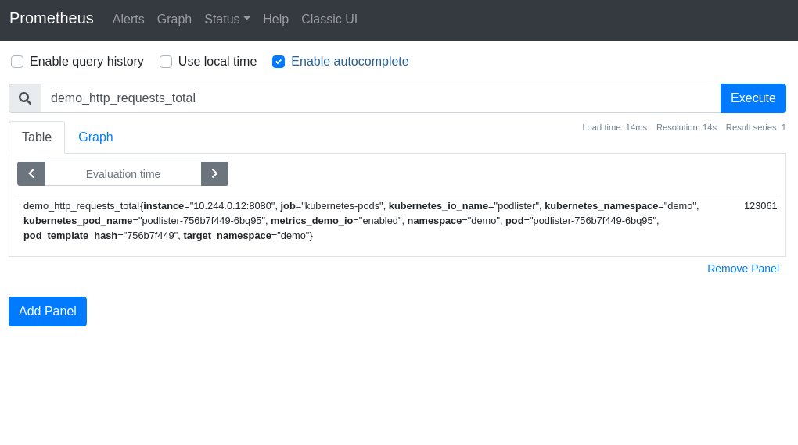

# promdump

promdump dumps the head and persistent blocks of Prometheus. Persistent blocks
can be filtered by time range.

## Why This Tool

When debugging users' Kubernetes clusters with restrictive access, I often find
it helpful to get access to their Prometheus metrics. To reduce the amount of
back-and-forth with the users (due to missing metrics, incorrect labels etc.),
it makes sense to ask the users to _"get me everything around the time of the
incident"_.

The most common way to achieve this is to use commands like `kubectl exec` and
`kubectl cp` to compress and dump Prometheus' entire data directory. On
non-trivial clusters, the resulting compressed file can be very large. To
import the data into a local test instance, I will need at least the same amount
of disk space.

promdump is a tool that can be used to dump Prometheus data blocks. It is
different from the `promtool tsdb dump` command in such a way that its output
can be re-used in another Prometheus instance. See this
[issue](https://github.com/prometheus/prometheus/issues/8281) for a discussion
on the limitation on the output of `promtool tsdb dump`. And unlike the
Promethues TSDB `snapshot` API, promdump doesn't require Prometheus to be
started with the `--web.enable-admin-api` option. Instead of dumping the entir
e TSDB, promdump offers the flexibility to filter persistent blocks by time
range.

## How It Works

The promdump CLI downloads the `promdump-$(VERSION).tar.gz` file from a
[public storage bucket](https://github.com/ihcsim/promdump/blob/98d9aebc80280fd5a6ca0fb3bed2418d822ac96f/cli/cmd/root.go#L25)
to your local `/tmp` folder. The download will be skipped if such a file already
exists. The `-f` option can be used to force a re-download.

Then the CLI uploads the decompresses the promdump binary to the targeted
Prometheus container, via the pod's `exec` subresource.

Within the Prometheus container, promdump queries the Prometheus TSDB using the
[`tsdb`](https://pkg.go.dev/github.com/prometheus/prometheus/tsdb) package. It
reads and streams the WAL files, head block and persistent blocks to stdout. To
regulate the size of the dump, persistent blocks can be filtered by time range.

⭐ promdump performs read-only operations on the TSDB.

When the data dump is completed, the promdump binary will be automatically
deleted from your Prometheus container.

The `restore` subcommand can then be used to copy this compressed file to
another Prometheus container. When this container is restarted, it will
reconstruct its in-memory index and chunks using the restored on-disk
memory-mapped chunks and WAL.

The `--debug` option can be used to output more verbose logs for each command.

## Getting Started

Install promdump as a `kubectl` plugin:
```sh

```

The promdump CLI can also be downloaded from the Release page.

For demonstration purposes, use [kind](https://kind.sigs.k8s.io/) to create two
K8s clusters:
```sh
$ kind create cluster --name dev-00

$ kind create cluster --name dev-01
```

Install Prometheus on both clusters using the community
[Helm chart](https://github.com/prometheus-community/helm-charts/tree/main/charts/prometheus):
```sh
helm --kube-context=kind-dev-00 install prometheus prometheus-community/prometheus

helm --kube-context=kind-dev-01 install prometheus prometheus-community/prometheus
```

Deploy a custom controller to cluster `dev-00`. This controller is annotated to
be scraped by Prometheus:
```sh
kubectl --context=kind-dev-00 apply -f https://raw.githubusercontent.com/ihcsim/controllers/master/podlister/deployment.yaml
```

Port-forward to the Prometheus pod to find the custom `demo_http_requests_total`
metric. Later, we will use promdump to copy the samples of this metric over to
the `dev-01` cluster:
```sh
CONTEXT="kind-dev-00"
POD_NAME=$(kubectl --context "${CONTEXT}" get pods --namespace default -l "app=prometheus,component=server" -o jsonpath="{.items[0].metadata.name}")
kubectl --context="${CONTEXT}" port-forward "${POD_NAME}" 9090
```



Dump the data from the first cluster:
```sh
CONTAINER_NAME="prometheus-server"
DATA_DIR="/data"

# check the tsdb metadata
kubectl promdump meta \
  --context "${CONTEXT}" \
  -p "${POD_NAME}" \
  -c "${CONTAINER_NAME}" \
  -d "${DATA_DIR}"
Earliest time:          | 2021-03-28 18:29:37
Latest time:            | 2021-04-07 20:00:00
Total number of blocks  | 17
Total number of samples | 459813486
Total number of series  | 186483
Total size              | 388639976

# capture the data dump
TARFILE="dump-`date +%s`.tar.gz"
kubectl promdump \
  --context "${CONTEXT}" \
  -p "${POD_NAME}" \
  -c "${CONTAINER_NAME}" \
  -d "${DATA_DIR}" \
  --start-time "2021-04-01 00:00:00" \
  --end-time "2021-04-07 16:02:00"  > "${TARFILE}"

# view the content of the tar file
$ tar -tf "target/testdata/${TARFILE}"
```

Restore the data dump to the Prometheus pod on the `dev-01` cluster:
```sh
CONTEXT="kind-dev-01"
POD_NAME=$(kubectl --context "${CONTEXT}" get pods --namespace default -l "app=prometheus,component=server" -o jsonpath="{.items[0].metadata.name}")
CONTAINER_NAME="prometheus-server"
DATA_DIR="/data"

# check the tsdb metadata
kubectl promdump meta \
  --context "${CONTEXT}" \
  -p "${POD_NAME}" \
  -c "${CONTAINER_NAME}" \
  -d "${DATA_DIR}"

# restore the data dump found at ${TARFILE}
kubectl promdump restore \
  --context="${CONTEXT}" \
  -p "${POD_NAME}" \
  -c "${CONTAINER_NAME}" \
  -d "${DATA_DIR}" \
  -t "${TARFILE}"

kubectl --context="${CONTEXT}" exec "${POD_NAME}" -c "${CONTAINER_NAME}" -- ls -al "${DATA_DIR}"
```

Port-forward to the Prometheus pod and confirm that the samples of the
`demo_http_requests_total` metric have been copied over:
```sh
kubectl --context=${CONTEXT} port-forward ${POD_NAME} 9091:9090
```

## Limitations

promdump is still in its experimental phase. It is used mainly to help with
debugging issues. It's not suitable for production backup/restore operation.

Like `kubectl cp`, promdump requires the `tar` binary in the Prometheus
container.

Currently, promdump only retrieves samples persisted in the on-disk blocks. It
doesn't account for in-memory chunk data and content in the WAL file.

## License

Licensed under the Apache License, Version 2.0 (the "License"); you may not use
these files except in compliance with the License. You may obtain a copy of the
License at:

```
http://www.apache.org/licenses/LICENSE-2.0
```

Unless required by applicable law or agreed to in writing, software distributed
under the License is distributed on an "AS IS" BASIS, WITHOUT WARRANTIES OR
CONDITIONS OF ANY KIND, either express or implied. See the License for the
specific language governing permissions and limitations under the License.
