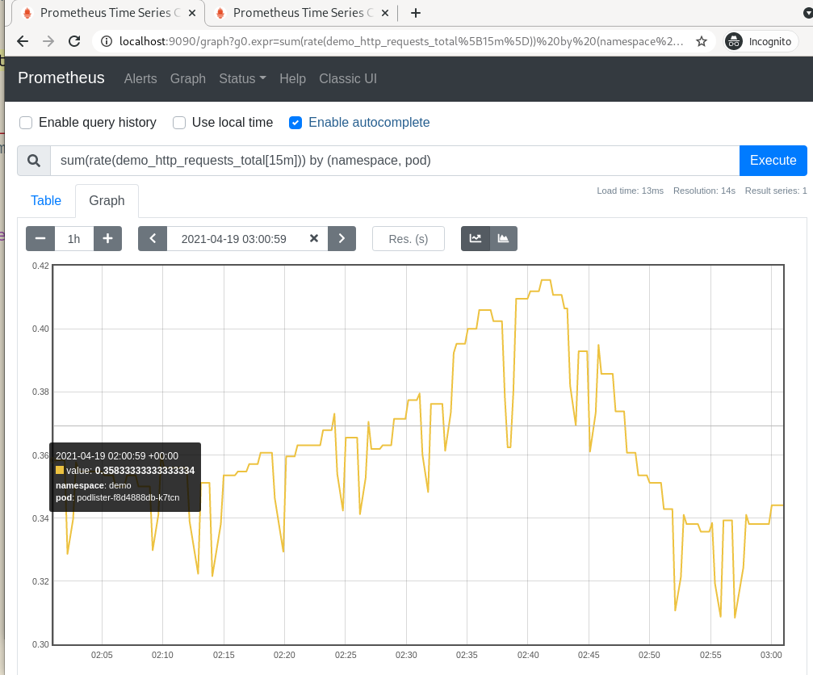
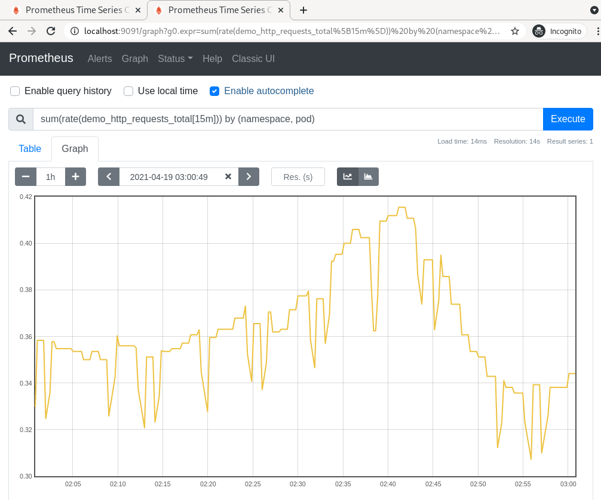

# promdump


promdump dumps the head and persistent blocks of Prometheus. It supports
filtering the persistent blocks by time range.

* [Why This Tool](#why-this-tool)
* [How It Works](#how-it-works)
* [Getting Started](#getting-started)
* [FAQ](#faq)
* [Limitations](#limitations)
* [Development](#development)
* [License](#license)

## Why This Tool

When debugging Kubernetes clusters with restrictive access, I often find it
helpful to get access to the in-cluster Prometheus metrics. To reduce the amount
of back-and-forth with the users (due to missing metrics, incorrect labels etc.)
, it makes sense to ask the users to _"get me everything around the time of the
incident"_.

The most common way to achieve this is to use commands like `kubectl exec` and
`kubectl cp` to compress and dump Prometheus' entire data directory. On
non-trivial clusters, the resulting compressed file can be very large. To
import the data into a local test instance, I will need at least the same amount
of disk space.

promdump is a tool that can be used to dump Prometheus data blocks. It is
different from the `promtool tsdb dump` command in such a way that its output
can be re-used in another Prometheus instance. See this
[issue](https://github.com/prometheus/prometheus/issues/8281) for a discussion
on the limitation on the output of `promtool tsdb dump`. And unlike the
Promethues TSDB `snapshot` API, promdump doesn't require Prometheus to be
started with the `--web.enable-admin-api` option. Instead of dumping the entire
TSDB, promdump offers the flexibility to filter persistent blocks by time range.

## How It Works

The promdump CLI downloads the `promdump-$(VERSION).tar.gz` file from a
[public storage bucket](https://github.com/ihcsim/promdump/blob/98d9aebc80280fd5a6ca0fb3bed2418d822ac96f/cli/cmd/root.go#L25)
to your local `/tmp` folder. The download will be skipped if such a file already
exists. The `-f` option can be used to force a re-download.

Then the CLI uploads the decompressed promdump binary to the targeted Prometheus
container, via the pod's `exec` subresource.

Within the Prometheus container, promdump queries the Prometheus TSDB using the
[`tsdb`](https://pkg.go.dev/github.com/prometheus/prometheus/tsdb) package. It
reads and streams the WAL files, head block and persistent blocks to stdout,
which can be redirected to a file on your local file system. To regulate the
size of the dump, persistent blocks can be filtered by time range.

⭐ _promdump performs read-only operations on the TSDB._

When the data dump is completed, the promdump binary will be automatically
deleted from your Prometheus container.

The `restore` subcommand can then be used to copy this dump file to another
Prometheus container. When this container is restarted, it will reconstruct its
in-memory index and chunks using the restored on-disk memory-mapped chunks and
WAL.

The `--debug` option can be used to output more verbose logs for each command.

## Getting Started

Install promdump as a `kubectl` plugin:
```sh
kubectl krew update

kubectl krew install promdump

kubectl promdump --version
```

For demonstration purposes, use [kind](https://kind.sigs.k8s.io/) to create two
K8s clusters:
```sh
for i in {0..1}; do \
  kind create cluster --name dev-0$i ;\
done
```

Install Prometheus on both clusters using the community
[Helm chart](https://github.com/prometheus-community/helm-charts/tree/main/charts/prometheus):
```sh
for i in {0..1}; do \
  helm --kube-context=kind-dev-0$i install prometheus prometheus-community/prometheus ;\
done
```

Deploy a custom controller to cluster `dev-00`. This controller is annotated for
metrics scraping:
```sh
kubectl --context=kind-dev-00 apply -f https://raw.githubusercontent.com/ihcsim/controllers/master/podlister/deployment.yaml
```

Port-forward to the Prometheus pod to find the custom `demo_http_requests_total`
metric.

📝 _Later, we will use promdump to copy the samples of this metric over to the
`dev-01` cluster._

```sh
CONTEXT="kind-dev-00"
POD_NAME=$(kubectl --context "${CONTEXT}" get pods --namespace default -l "app=prometheus,component=server" -o jsonpath="{.items[0].metadata.name}")
kubectl --context="${CONTEXT}" port-forward "${POD_NAME}" 9090
```



📝 _In subsequent commands, the `-c` and `-d` options can be used to change
the container name and data directoy._

Dump the data from the first cluster:
```sh
# check the tsdb metadata
kubectl promdump meta --context=$CONTEXT -p $POD_NAME
Head Block Metadata
------------------------
Minimum time (UTC): | 2021-04-18 18:00:03
Maximum time (UTC): | 2021-04-18 20:34:48
Number of series    | 18453

Persistent Blocks Metadata
----------------------------
Minimum time (UTC):     | 2021-04-15 03:19:10
Maximum time (UTC):     | 2021-04-18 18:00:00
Total number of blocks  | 9
Total number of samples | 92561234
Total number of series  | 181304
Total size              | 139272005

# capture the data dump
TARFILE="dump-`date +%s`.tar.gz"
kubectl promdump \
  --context "${CONTEXT}" \
  -p "${POD_NAME}" \
  --min-time "2021-04-15 03:19:10" \
  --max-time "2021-04-18 20:34:48"  > "${TARFILE}"

# view the content of the tar file. expect to see the 'chunk_heads', 'wal' and
# persistent blocks directories.
$ tar -tf "${TARFILE}"
```

Restore the data dump to the Prometheus pod on the `dev-01` cluster, where we
don't have the custom controller:
```sh
CONTEXT="kind-dev-01"
POD_NAME=$(kubectl --context "${CONTEXT}" get pods --namespace default -l "app=prometheus,component=server" -o jsonpath="{.items[0].metadata.name}")

# check the tsdb metadata
kubectl promdump meta --context "${CONTEXT}" -p "${POD_NAME}"
Head Block Metadata
------------------------
Minimum time (UTC): | 2021-04-18 20:39:21
Maximum time (UTC): | 2021-04-18 20:47:30
Number of series    | 20390

No persistent blocks found

# restore the data dump found at ${TARFILE}
kubectl promdump restore \
  --context="${CONTEXT}" \
  -p "${POD_NAME}" \
  -t "${TARFILE}"

# check the metadata again. it should match that of the dev-00 cluster
kubectl promdump meta --context "${CONTEXT}" -p "${POD_NAME}"
Head Block Metadata
------------------------
Minimum time (UTC): | 2021-04-18 18:00:03
Maximum time (UTC): | 2021-04-18 20:35:48
Number of series    | 18453

Persistent Blocks Metadata
----------------------------
Minimum time (UTC):     | 2021-04-15 03:19:10
Maximum time (UTC):     | 2021-04-18 18:00:00
Total number of blocks  | 9
Total number of samples | 92561234
Total number of series  | 181304
Total size              | 139272005

# confirm that the WAL, head and persistent blocks are copied to the targeted
# Prometheus server
kubectl --context="${CONTEXT}" exec "${POD_NAME}" -c prometheus-server -- ls -al /data
```

Restart the Prometheus pod:
```sh
kubectl --context="${CONTEXT}" delete po "${POD_NAME}"
```

Port-forward to the pod to confirm that the samples of
the `demo_http_requests_total` metric have been copied over:
```sh
kubectl --context="${CONTEXT}" port-forward "${POD_NAME}" 9091:9090
```

Make sure that time frame of your query matches that of the restored data.



## FAQ

Q: The `promdump meta` subcommand shows that the time range of the restored
persistent data blocks is different from the ones I specified.

A: There isn't a way to fetch partial data blocks from the TSDB. If the time
range you specified spans across multiple data blocks, then all of them need
to be retrieved. The amount of excessive data retrieved is dependent on the
span of the data blocks.

The time range reported by the `promdump meta` subcommand should cover the one
you specified.

----
Q: I am not seeing the restored data

A: There are a few things you can check:

* When generating the dump, make sure the start and end date times are
specified in the UTC time zone.
* If using the Prometheus console, make sure the time filter falls within the
time range of your data dump. You can confirm your restored data time range
using the `promdump meta` subcommand.
* Compare the TSDB metadata of the target Prometheus with the source Prometheus
to see if their time range match, using the `promdump meta` subcommand.
The head block metadata may deviate slightly depending on how old your data dump
is.
* Use the `kubectl exec` command to run commands likes `ls -al <data_dir>`
and `cat <data_dir>/<data_block>/meta.json` to confirm the data range of a
particular data block.
* Try restarting the target Prometheus pod after the restoration to let
Prometheus replay the restored WALs. The restored data must be persisted to
survive a restart.
* Check Prometheus logs to see if there are any errors due to corrupted data
blocks, and report any [issues](https://github.com/ihcsim/promdump/issues/new).
* Run the `promdump restore` subcommand with the `--debug` flag to see
if it provides more hints.

----
Q: The `promdump meta` and `promdump restore` subcommands are failing with this
error:
```sh
found unsequential head chunk files
```

A: This happens when there are out-of-sequence files in the `chunk_heads` folder
of the source Prometheus instance.

The `promdump` command can still be used to generate the dump `.tar.gz` file
because it doesn't parse the folder content, using the `tsdb` API.  It simply
adds the the entire `chunk_heads` folder to the dump `.tar.gz` file.

E.g, a dump file with 2 out-of-sequence head files may look like this:
```sh
$ tar -tf dump.tar.gz
./
./chunks_head/
./chunks_head/000027 # out-of-sequence
./chunks_head/000029 # out-of-sequence
./chunks_head/000033
./chunks_head/000034
./01F5ETH5T4MKTXJ1PEHQ71758P/
./01F5ETH5T4MKTXJ1PEHQ71758P/index
./01F5ETH5T4MKTXJ1PEHQ71758P/chunks/
./01F5ETH5T4MKTXJ1PEHQ71758P/chunks/000001
./01F5ETH5T4MKTXJ1PEHQ71758P/meta.json
./01F5ETH5T4MKTXJ1PEHQ71758P/tombstones
...
```

Any attempts to restore this dump file will crash the target Prometheus with the
above error, complaining that files `000027` and `000028` are out-of-sequence.

To fix this dump file, we will have to manually delete those offending files:
```sh
mkdir temp

tar -xvfz dump.tar.gz -C temp

rm temp/chunks_head/000027 chunks_head/000029

tar -C temp -czvf restored.tar.gz .
```

Now you can restore the `restored.tar.gz` file to your target Prometheus with:
```
kubectl promdump restore -p $POD_NAME -t restored.tar.gz
```

Note that deleting those head files may cause some head data to be lost.

----
## Limitations

promdump is still in its experimental phase. SREs can use it to copy data blocks
from one Prometheus instance to another development instance, while debugging
cluster issues.

Before restoring the data dump, promdump will erase the content of the data
folder in the target Prometheus instance, to avoid corrupting the data blocks
due to conflicting segment error such as:

```sh
opening storage failed: get segment range: segments are not sequential
```

Restoring a data dump containing out-of-sequence head blocks will crash the
target Prometheus. See [FAQ](#faq) on how to fix the data dump.

promdump not suitable for production backup/restore operation.

Like `kubectl cp`, promdump requires the `tar` binary to be installed in the
Prometheus container.

## Development

To run linters and unit test:
```sh
make lint test
```

To produce local builds:
```sh
# the kubectl CLI plugin
make cli

# the promdump core
make core
```

To install Prometheus via Helm:
```sh
make hack/prometheus
```

To do a release:
```sh
git tag -a v$version

make dist release
```
Note that the GitHub Actions pipeline uses the same make release targets.

## License

Licensed under the Apache License, Version 2.0 (the "License"); you may not use
these files except in compliance with the License. You may obtain a copy of the
License at:

```
http://www.apache.org/licenses/LICENSE-2.0
```

Unless required by applicable law or agreed to in writing, software distributed
under the License is distributed on an "AS IS" BASIS, WITHOUT WARRANTIES OR
CONDITIONS OF ANY KIND, either express or implied. See the License for the
specific language governing permissions and limitations under the License.
